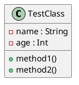

# Kotlin UML Generator (KSP)

Проект демонстрирует использование **Kotlin Symbol Processing (KSP)** для автоматической генерации UML-диаграмм из Kotlin-классов.

Во время компиляции аннотированные классы обрабатываются кастомным KSP-процессором, который генерирует UML описание.

---

# Текущий этап реализации

На текущем этапе проекта реализована основная часть анализа кода.

С помощью **Kotlin Symbol Processing (KSP)** выполняется:

- поиск классов, отмеченных аннотацией `@UmlDiagram`
- анализ структуры классов во время компиляции
- генерация UML-описания класса в формате **PlantUML**

В результате сборки проекта автоматически создается UML-описание классов, которое можно использовать для визуализации архитектуры.

---

# Планируемое развитие проекта

Следующий этап проекта предполагает расширение анализа структуры кода.

Планируется:

### 1. Расширенный анализ классов
- сбор информации о методах и полях классов
- определение зависимостей между классами
- генерация более полной UML-диаграммы

### 2. Анализ взаимодействия между классами
На основе собранной UML-диаграммы можно определить:
- какие классы чаще всего взаимодействуют
- какие классы являются центральными в архитектуре
- возможные зависимости между модулями системы

### 3. Использование LLM для анализа архитектуры
Сгенерированная UML-диаграмма может быть передана языковой модели (LLM) для дополнительного анализа.

Модель может:
- предположить возможный поток данных между классами
- выявить наиболее связанные компоненты системы
- предложить возможные улучшения архитектуры

Таким образом, проект может использоваться как инструмент для автоматического анализа архитектуры Kotlin-проектов.

---

# Используемые технологии

- Kotlin
- Gradle
- KSP (Kotlin Symbol Processing)
- PlantUML

---

# Структура проекта

```kotlin
kotlin-uml-ksp
├── processor
│   ├── UmlDiagram.kt
│   ├── UmlProcessor.kt
│   └── UmlProcessorProvider.kt
│
├── src
│   └── main
│       └── kotlin
│           ├── Main.kt
│           └── TestClass.kt
│
├── build.gradle.kts
├── settings.gradle.kts
└── README.md

```


# Аннотация

Для генерации UML используется аннотация:

```kotlin
@Target(AnnotationTarget.CLASS)
@Retention(AnnotationRetention.SOURCE)
annotation class UmlDiagram
```

# Пример использования
```kotlin
@UmlDiagram
class TestClass {
fun method1() {
}}
```

## UML Example



# Запуск проекта

Собрать проект:
```kotlin
./gradlew build
```
или
```kotlin
./gradlew kspKotlin
```

Автор Анастасия Ципенюк